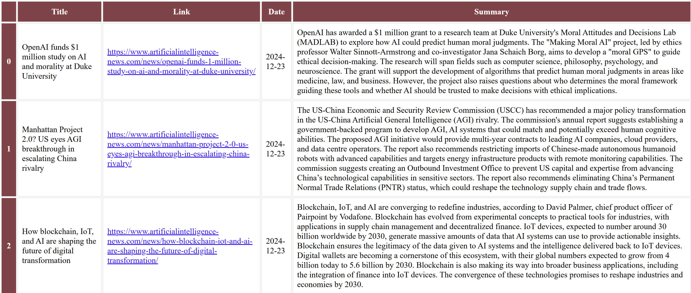

# AI Article Scraper and Summarizer

## IMPORTANT DISCLAIMER
This project is for **PERSONAL USE ONLY**. It was created as a learning exercise and personal tool. If you're interested in using content from these sources, please:
- Visit their official websites
- Subscribe to their official newsletters
- Check their terms of service and API documentation
- Obtain necessary permissions for any commercial use

## Overview
This project automatically scrapes AI-related articles from multiple sources (AI News, MIT News, Stanford News), summarizes them, and sends email reports. It's designed to help keep track of the latest developments in AI across different academic institutions and news sources, providing a consolidated daily digest.

## Features
- Multi-source article scraping (AI News, MIT News, Stanford News)
- Email report generation with formatted HTML
- Date-based article filtering
- CSV and HTML output formats
- Configurable email recipients

## Project Structure
```
AI_article_summarizer/
│
├── src/
│   ├── init.py
│   ├── scraper.py        # Web scraping functionality
│   ├── summarizer.py     # Article summarization
│   ├── email_sender.py   # Email reporting
│   └── utils.py          # Helper functions
│
├── config/
│   ├── init.py
│   └── config.py         # Configuration settings
│
├── data/                 # Stored article data
├── results/              # HTML reports
├── logs/                 # Application logs
├── notebooks/           # Development notebooks
├── requirements.txt
├── main.py              # Main execution script
└── .env                 # Environment variables
```

## Setup
1. Clone the repository:
   ```bash
   git clone <repository_url>
   ```
2. Install required packages:
   ```bash
   pip install -r requirements.txt
   ```
3. Create a .env file with your credentials:
   ```env
   EMAIL="your_email@gmail.com"
   PASSWORD="your_app_specific_password"
   IMAP_SERVER="imap.gmail.com"
   RECIPIENT_EMAILS=["recipient@example.com"]
   OPENAI_API_KEY="API key"
   ```
   Note: For Gmail, use an App Password generated from your Google Account settings.

## Configuration

- config.py: Contains configuration settings
- .env: Stores sensitive information like email credentials
- Customize source URLs and other settings in the configuration files

## Usage
Run the main script:
   ```bash
   python main.py
   ```

This will:

- Scrape articles from configured sources
- Generate summaries
- Create CSV and HTML reports
- Send email digest to configured recipients

## Output

- CSV files in data/ folder: articles_week_YYYY-MM-DD.csv
- HTML reports in results/ folder: articles_week_YYYY-MM-DD.html
- Email reports sent to configured recipients
- Logs in logs/ folder

## Development

Development process and experiments are documented in Jupyter notebooks in the notebooks/ directory

See development.ipynb for code evolution and testing

## Error Handling

- Comprehensive logging system
- Email sending retry mechanism
- Graceful handling of scraping failures

## Future Improvements

- Add more news sources
- Implement article categorization
- Add web interface for configuration
- Include sentiment analysis

## Contributing
Feel free to submit issues and enhancement requests!

## Output example
## Preview


## Legal Notice
This tool is:
- For personal and educational use only
- Not for commercial use
- Not affiliated with any of the news sources
- Subject to the terms of service of the respective websites

Please respect copyright and terms of service when using this tool. The author assumes no responsibility for misuse or any violations of terms of service.
