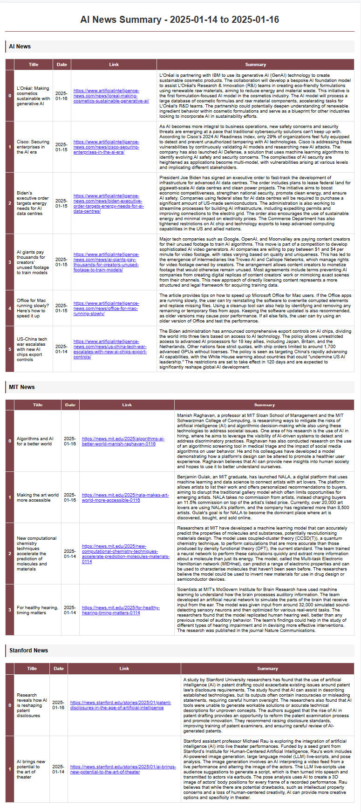

# Article Scraper and Summarizer

## Overview
This project scrapes articles from a news website, summarizes them using OpenAI, and outputs the results in CSV and HTML formats. It's designed to automate the process of content extraction and provide a concise summary for easy review. The tool is especially useful for staying up to date with AI-related news, providing an easy way to skim summaries and open articles of interest.

## Features
- Scrapes articles from [Artificial Intelligence News](https://www.artificialintelligence-news.com).
- Summarizes articles using OpenAI's GPT model.
- Outputs results as a CSV file and a styled HTML file.

## Files
- `script.ipynb`: Jupyter Notebook containing the main code.
- `data/articles_<date>.csv`: CSV file with scraped and summarized articles.
- `results/output.html`: HTML file with clickable links and summaries.

## How to Run
1. Clone the repository:
   ```bash
   git clone <repository_url>
   ```
2. Install the required Python packages:
   ```bash
   pip install -r requirements.txt
   ```
3. Open `script.ipynb` in Jupyter Notebook or VSCode and run the cells.
4. Find the generated files in the `data/` and `results/` folders.

## Why It’s Useful
- Quickly review the latest news without having to visit multiple websites.
- Access concise summaries to decide which articles are worth reading in full.
- Clickable links make it easy to open the original articles.

## Preview
